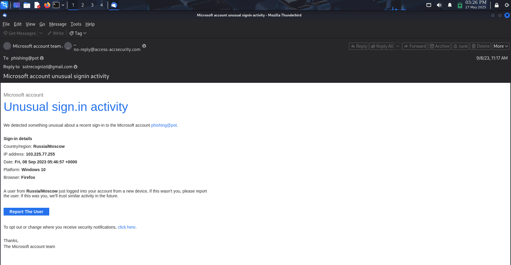

# 🛡️Phishing Email Analysis Report

## Basic Information

| Field           | Value          |
|-----------------|---------------|
| **File Name**   | sample-10.eml |
| **Date Analyzed** | 2025-05-27   |

## Summary of Steps Taken

Downloaded a sample phishing email (.eml file) from an Opensource GitHub repository.

Opened the email using Thunderbird on Kali Linux.

Copied the email header from Thunderbird.

Analyzed the header using MXToolbox Header Analyzer. 

### 📥 Source of Sample Phishing Email

The sample phishing email used in this task was downloaded from the following open-source repository:

🔗 [rf-peixoto/phishing_pot – GitHub Repository](https://github.com/rf-peixoto/phishing_pot/tree/main)

> This repository contains various examples of phishing emails for educational and research purposes.

---

## 🔎Header Analysis

| Field            | Details                                               |
|------------------|------------------------------------------------------|
| **From**         | Microsoft account team <no-reply@access-accsecurity.com> |
| **Reply-To**     | sotrecognizd@gmail.com                               |
| **Return Path**  | bounce@thcultarfdes.co.uk                            |
| **Sender IP**    | 89.144.44.2                                          |
| **SPF**          | None — Domain did not authorize this sender          |
| **DKIM/DMARC**   | Not configured                                       |
| **Subject**      | Microsoft account unusual signin activity            |
| **Date**         | Fri, 8 Sep 2023 05:47:04 +0000                       |

### 🔍Header Findings

- **Sender domain mismatch:** The "From" address claims to be Microsoft but uses a suspicious domain (`access-accsecurity.com`).
- **Return Path and Reply-To:** Both use unrelated domains (`thcultarfdes.co.uk`, `gmail.com`), indicating likely spoofing.
- **SPF Failure & DMARC Not Configured:** The email lacks proper authentication, a common phishing trait.
- **High Priority Flag:** Set to invoke urgency.

---

### 📸Screenshots

## Received Mail

## Generated report by MXheaderanaalyser

---

## 🎣Phishing Indicators Identified

| Indicator Type             | Description                                                                                          |
|----------------------------|------------------------------------------------------------------------------------------------------|
| **Spoofed Email Address**  | Appears to be Microsoft, but the domain is fake (`access-accsecurity.com`).                         |
| **Fake Reply Address**     | Replies are sent to a Gmail account (`sotrecognizd@gmail.com`).                                     |
| **Suspicious Links**       | The “Report the User” button is a mailto: link to `sotrecognizd@gmail.com`, not Microsoft.          |
| **Threatening/Urgent Language** | Uses urgent language: “If this wasn't you, please report the user"                             |                            
| **Mismatch in Message & Links** | Appears to be a login alert, but links open an email composer instead of a Microsoft page.      |
| **Grammar Errors**         | Phrases like "sign.in activity", inconsistent spacing/punctuation.                                   |
| **Unfamiliar IP/Location** | Claims a login from “Russia/Moscow” using `103.225.77.255` to induce fear.                          |
| **No Official Branding**   | No digital signature, official footer, or policy links.                                             |

---

## ✅ Summary 

| Field                | Finding/Red Flag                                                                                      |
|----------------------|-------------------------------------------------------------------------------------------------------|
| **From**             | access-accsecurity.com (not Microsoft)                                                                |
| **Reply-To**         | Gmail address (not Microsoft)                                                                         |
| **Return Path**      | Unrelated domain (thcultarfdes.co.uk)                                                                 |
| **SPF/DKIM/DMARC**   | Not configured/failed                                                                                 |
| **Sender IP**        | 89.144.44.2 (not Microsoft)                                                                           |
| **Subject**          | Urgent, threatening language                                                                          |
| **Links**            | “Report the User” goes to Gmail, not Microsoft                                                        |
| **Grammar/Branding** | Errors and missing official branding                                                                  |
| **Claimed Location** | Russia/Moscow, unfamiliar IP to Induce Fear                                                           |

---

##  Conclusion

This email contains multiple classic phishing indicators, including:

- Spoofed sender and reply addresses
- Urgent and manipulative language
- Suspicious links and tracking pixels
- Authentication failures (SPF/DKIM/DMARC)
- Grammar errors, and lack of branding

**Recommendation:**  
Do not interact with the similar mail. Mark it as phishing and report it to your IT/security team. Use this analysis as a reference for identifying similar threats in the future.

---
